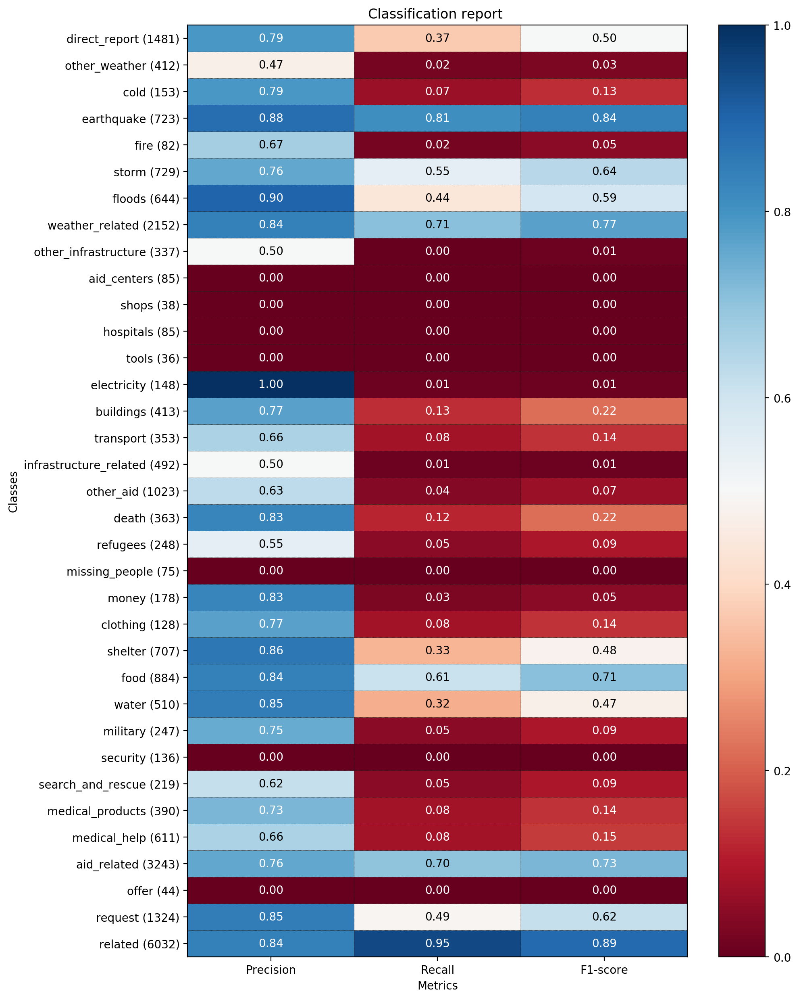

# udacity-dsnd-project2
Udacity Data Science Nanodegree Project 2 - Disaster Response Pipeline

### Table of Contents

1. [Instructions](#instructions)
2. [Project Motivation](#motivation)
3. [Data Descriptions](#data)
4. [File Descriptions](#files)
5. [Results and Discussion](#results)
6. [Licensing, Authors, and Acknowledgements](#licensing)

## Instructions <a name="instructions"></a>

# Disaster Response Pipeline Project

### Instructions:

1. Run the following commands in the project's root directory to set up your database and model.

    - To run ETL pipeline that cleans data and stores in database
    
        ```python data/process_data.py data/disaster_messages.csv data/disaster_categories.csv data/DisasterResponse.db```
        
    - To run ML pipeline that trains classifier and saves
        
        ```python models/train_classifier.py data/DisasterResponse.db models/classifier.pkl```

2. Run the following command in the app's directory to run your web app.
    `python run.py`

3. Go to http://0.0.0.0:3001/

## Project Motivation<a name="motivation"></a>

This project classifies messages sent during a disaster in order to direct them to an appropriate disaster relief agency. 

## Data Descriptions <a name="data"></a>
  
  1) `disaster_messages.csv`: messages sent during disasters via social media or directly to disaster response organizations
  2) `disaster_categories.csv`: category of disaster messages (36 options total)

## File Descriptions <a name="files"></a>

The repository contains the following files:

    1) data/process_data.py : ETL pipeline to merge and clean the disaster messages and categories into the sqlite DisasterResponses.db
    2) models/train_classifier.py : model pipeline to train and classify the disaster messages into categories
    3) models/viz_results.py : functions to plot the classification results (precision, recall, f1-score)

## Results and Discussion<a name="results"></a>

For this project I tested out both the SGD (Stochastic Gradient Descent- Support Vector Machine) and Random Forest Classifiers, and endd up using the Random Forest Model. Results were fairly good for categories that had a larger number of samples, but were generally poor for samples with < 200 data points. In fact many of these categories with small sample sizes ended up with recall and f-scores of zero and had the following warning:

```UndefinedMetricWarning: Recall and F-score are ill-defined and being set to 0.0 in samples with no true labels.```

Below shows the classification report, where blues are good scores and red are poor scores. This plot was made using the viz_results.py module, which was copied and modified from this [stack overflow post](https://stackoverflow.com/questions/28200786/how-to-plot-scikit-learn-classification-report). You can that the performance is almost entirely related to the number of samples (support):



The child_alone category, for example, didn't have any training data (this column consisted of all zeros, so was never categorized). This caused some models (eg. the SGD) to fail because each category needs to have at least one data point. Due to this lack of data, I omitted this category. 

The best way to improve the model would be to include more training data, particularly for categories which aren't represented as much. Then GridSearchCV and other model parameter tuning would work well. 

## Licensing, Authors, Acknowledgments <a name="licensing"></a>

Data is provided by [Figure Eight](https://www.figure-eight.com/) The code here is licensed under open source GNU General Public License v3.0, and is free to use as you wish, with no guarantees :)
